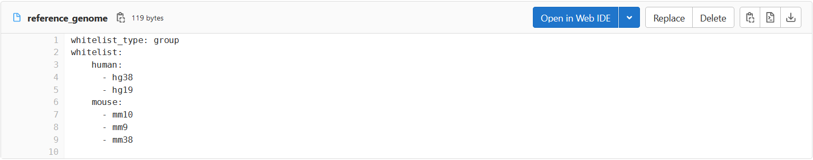

## Whitelist storage

The whitelists for the project are located in the git repository inside the 'whitelists' folder. All newly created whitelist files must also be placed in this folder so that the metadata tool can read them.

The naming of the whitelists is identical to the key for which it is created. For example, the whitelist for the key 'organism' is also named 'organism'. 

The whitelist files have the format yaml. For each whitelist two mandatory keys must be specified. The first one is 'whitelist_type' and describes the nature of the whitelist and how it must be processed in the program. There are four different whitelist types, which are described in more detail in the sections below.
The second mandatory key is called 'whitelist' and contains the values that can be accepted by the metadata field for which the whitelist was created.

## Whitelist types

### Type 1: plain

Whitelists of type plain are the simplest way to set values for a metadata field. A simple list of potential values is specified for the key whitelist. 

__Example:__

<table>
<tr>
<th>
whitelists/gender
</th>
</tr>
<tr>
<td>

```yaml
whitelist_type: plain
whitelist:
  - male
  - female
  - mixed
```

</td>
</tr>
</table>

### Type 2: group

This whitelist type is used to group the values within the whitelist for better organization. Here, the key whitelist receives a dictionary as value, whose keys represent subheadings. For these keys, thematically matching values are then stored in a list. When generating the metadata, the whitelist values are output in the same grouping as defined in the whitelist file. The aim of this whitelist type is to improve the clarity when creating and extending the whitelists as well as when generating the metadata file.

__Example:__

<table>
<tr>
<th>
whitelists/disease_type
</th>
</tr>
<tr>
<td> 
<div>
The whitelist values for 'disease_type' were grouped based on the organs affected by the disease.<br>
This allows faster finding of diseases in the list, as well as a better overview.
</div>
</td> 
</tr>
<tr>
<td>

```yaml
whitelist_type: group
whitelist:
  lung:
    - lung cancer
    - COPD
    - PH
    ...
  heart:
    - Coronary heart disease CHD
    - Angina
    - Blood pressure
    ...
  other:
    - breast cancer
    - prostate cancer
```

</td>
</tr>
</table>


### Type 3: depend

This type of whitelist is used when the values depend on the input of another key in the metadata structure. Each whitelist file of type depend contains beside 'whitelist_type' and 'whitelist' the further mandatory key 'ident_key'. This identifies the key in the metadata structure on whose input the whitelist should depend. For example, if you want to make the whitelist for genes dependent on the organism under investigation, set the value for 'ident_key' to 'organism_name'.
The key 'whitelist' receives a dictionary whose keys represent the possible values of the metadata field specified in 'ident_key'. These keys are then assigned the values in a list, which an input can accept depending on this key.

__Example:__

<table>
<tr>
<th>
whitelists/reference_genome
</th>
<th>
whitelists/organism
</th>
</tr>
<tr>
<td> 
<div>
In this example, the whitelist for the reference<br>
genome is represented as depending on the<br> 
organism.For this reason, the 'ident_key' is<br> 
assigned 'organism_name'. The possible organisms<br> 
form the keys specified under 'whitelist'. Their<br>
values are those reference genomes that can be<br> 
set for the respective organism.
</div>
</td> 
<td> 
<div>
The whitelist for 'organism_name' contains<br> 
all allowed organisms as values. These form<br> 
the keys in the dependent whitelist<br> 
'reference_genome'.
</div>
</td>
</tr>
<tr>
<td>

```yaml
whitelist_type: depend
ident_key: organism_name
whitelist:
  human_9606:
    - hg38
    - hg19
  mouse_10090:
    - mm10
    - mm9
    - mm38
  zebrafish_7955:
    - danrer11
    - danrer10
  ...
```

</td>
<td>

```yaml
whitelist_type: plain
whitelist:
  - human_9606
  - mouse_10090
  - zebrafish_7955
  ...
```
</td>
</tr>
</table>

### Type 4: abbrev

This type of whitelist must be provided for all experimental factors, their values, and for the organisms. The fields mentioned are those from which file names for samples are generated during metadata creation. Since file names are limited in length, the values must be shortened using the abbrev whitelist. In this process, all special characters are also removed from the values.
Whitelists of type abbrev are located inside the 'whitelists' folder in the 'abbrev' folder. They are named after the key for whose values they contain the abbreviations.  
Here a dictionary is passed to the key 'whitelist'. The keys of this dictionary correspond to the values of the non-abbreviated whitelist. Each key receives its abbreviated version. If an non-abbreviated value has only a short length and does not contain any special characters, it does not have to be specified in the abbrev whitelist. In such a case it will be included unchanged in the filename.

__Example:__

<table>
<tr>
<th>
whitelists/abbrev/gender
</th>
<th>
whitelists/organism
</th>
</tr>
<tr>
<td> 
<div>
In this example, the abbrev whitelist was<br> 
created for the experimental factor gender.
</div>
</td> 
<td> 
<div>
Here you can see the non-abbreviated gender<br> 
whitelist for comparison.
</div>
</td>
</tr>
<tr>
<td>

```yaml
whitelist_type: abbrev
whitelist:
  male: m
  female: f
  mixed: x
```

</td>
<td>

```yaml
whitelist_type: plain
whitelist:
  - male
  - female
  - mixed
```

</td>
</tr>
</table>

A special case to be considered is when an experimental factor can take a dictionary as its value. In this case, not only the possible values for the keys within the dictionary, but also the key names themselves must be abbreviated.

__Example:__

<table>
<tr>
<th>
Extract for disease from <br>
keys.yaml
</th>
<th>
whitelists/abbrev/disease
</th>
<th>
whitelists/abbrev/disease_status<br>
whitelists/abbrev/disease_type
</th>
</tr>
<tr>
<td> 
<div>
As shown in the extract from <br>
keys.yaml, the experimental <br>
factor disease is divided <br>
into the subdomains status, <br>
type, and stage using an <br>
underlying dictionary.
</div>
</td> 
<td> 
<div>
Abbreviations must be created <br>
for the keys disease_status, <br>
disease_type and disease_stage<br> 
which are included in disease,<br> 
since these keys are also <br>
written in the file name.
</div>
</td>
<td> 
<div>
Here you can see the <br>
abbreviated whitelists for the <br>
values of the keys. For <br>
disease_stage no abbrev <br>
whitelist was created, because <br>
the included values are already<br>
very short and do not contain <br>
any special characters.
</div>
</td>
</tr>
<tr>
<td>

```yaml
disease:
  ...
  value:
    disease_type:
      ...
    disease_status:
      ...
    disease_stage:
      ...              

```

</td>
<td>

```yaml
whitelist_type: abbrev
whitelist:
  disease_status: sts
  disease_type: tp
  disease_stage: stg
```

</td>
<td>
<b>disease_status:</b>

```yaml
whitelist_type: abbrev
whitelist:
    healthy: hlth
    recovered: rcvd
```

<b>disease_type:</b>

```yaml
whitelist_type: abbrev
whitelist:
    Lung cancer: LngCnc
    Asthma: Asth
    Pneumonia: pneum
    ...
```

</td>
</tr>
</table>


## Linking whitelists

### Linking to existing whitelists

In addition to specifying possible values in the form of a list under the key 'whitelist', it is also possible to link to existing whitelist files. This is useful if the possible values of two different metadata fields are the same. In this case it is sufficient to create the values for only one of these fields and to link to the already created values in the whitelist of the other field. This way the values only have to be maintained in one place.
The following examples show how such a link can be built into various whitelists.

__Example 1 : plain__

This example shows what a link in a whitelist of type 'plain' can look like. Assume that a key setting_technique appears in the experimental setting section whereas a key technique is located in the technical details section. The former represents the sequencing technique used for the respective experimental setting. The latter summarizes all sequencing techniques used in the experiment. The possible techniques are the same in both fields.

<table>
<tr>
<th>
Extract for technique from <br>
keys.yaml
</th>
<th>
whitelists/technique
</th>
<th>
whitelists/setting_technique<br>
</th>
</tr>
<tr>
<td> 
<div>
TBA
</div>
</td> 
<td> 
<div>
TBA
</div>
</td>
<td> 
<div>
TBA
</div>
</td>
</tr>
<tr>
<td>

```yaml
TBA
```

</td>
<td>

```yaml
whitelist_type: plain
whitelist:
    - bulk RNA-seq
    - bulk RNA array
    - bulk ATAC-seq
    - bulk ChIP-seq
    ...
```

</td>
<td>

```yaml
whitelist_type: plain
whitelist: technique
```

</td>
</tr>
</table>


__Example 2 : group__

TBA enrichment

__Example 3 : depend__

If independent whitelist files already exist for the keys and the files are located in the folder whitelists and named exatly like the respective key, those keys can be omitted and the metadata tool reads the existing files as whitelist. This is e.g. the case for the whitelist 'values'. The key 'values' in the metadata structure contains the examined values of the examined experimental factor. So the whitelist for 'values' depends on the whitelist 'factor'. Since each experimental factor has its own whitelist, the keys for the experimental factors in the whitelist for 'value' can be omitted. Thus, the existing files are read in as whitelist.


<table>
<tr>
<td> 
<b>whitelists/values</b><br>The whitelist for values depends on the entered 'factor'. The value 'factor' is therefore assigned to the 'ident_key'.
</td> 
<td> 
<b>whitelists/factor</b><br>The key 'factor' also has a whitelist. All values specified in the whitelist 'factor' form possible keys in the whitelist 'values'.
</td>
<td> 
<b>whitelists/genotype</b><br>For the values in the whitelist 'factor' (e.g. genotype) there are separate whitelists named after the respective value. The values therefore no longer have to be specified as keys in the whitelist 'values'. The metadata tool reads the already existing files as whitelist.
</td> 
</tr>
<tr>
<td>

```yaml
whitelist_type: depend
ident_key: factor
```

</td>
<td>

```text
genotype
tissue
cell_type
knockdown
gender
...
```
</td>

<td>

```text
Mut
WT
```
</td>
</tr>
</table>

### Subdivide whitelists into smaller files

__Example:__


<table>
<tr>
<td> 
<b>whitelists/gene</b><br>The whitelists for the genes per organism are very long, which is why they are outsourced to individual files. The keys are named after the organisms and the path to the respective whitelist is given as value. 
</td> 
<td> 
<b>whitelists/genes/human</b><br>For the whitelists per organism a new folder 'genes' was created. The whitelists are named after the organism for which they contain the genes. The naming of the files does not follow any fixed rule but is subject to personal preference. 
</td>
</tr>
<tr>
<td>

```yaml
whitelist_type: depend
ident_key: organism
whitelist:
  human_9606: genes/human
  mouse_10090: genes/mouse
  zebrafish_7955: genes/zebrafish
...
```

</td>
<td>

```text
TSPAN6_ENSG00000000003
TNMD_ENSG00000000005
DPM1_ENSG00000000419
SCYL3_ENSG00000000457
C1orf112_ENSG00000000460
...
```
</td>
</tr>
</table>

If independent whitelist files already exist for the keys and the files are located in the folder whitelists and named exatly like the respective key, those keys can be omitted and the metadata tool reads the existing files as whitelist. This is e.g. the case for the whitelist 'values'. The key 'values' in the metadata structure contains the examined values of the examined experimental factor. So the whitelist for 'values' depends on the whitelist 'factor'. Since each experimental factor has its own whitelist, the keys for the experimental factors in the whitelist for 'value' can be omitted. Thus, the existing files are read in as whitelist.


<table>
<tr>
<td> 
<b>whitelists/values</b><br>The whitelist for values depends on the entered 'factor'. The value 'factor' is therefore assigned to the 'ident_key'.
</td> 
<td> 
<b>whitelists/factor</b><br>The key 'factor' also has a whitelist. All values specified in the whitelist 'factor' form possible keys in the whitelist 'values'.
</td>
<td> 
<b>whitelists/genotype</b><br>For the values in the whitelist 'factor' (e.g. genotype) there are separate whitelists named after the respective value. The values therefore no longer have to be specified as keys in the whitelist 'values'. The metadata tool reads the already existing files as whitelist.
</td> 
</tr>
<tr>
<td>

```yaml
whitelist_type: depend
ident_key: factor
```

</td>
<td>

```text
genotype
tissue
cell_type
knockdown
gender
...
```
</td>

<td>

```text
Mut
WT
```
</td>
</tr>
</table>


# Adding values to a whitelist

For this example, we will extend the whitelist for 'reference_genome' with the reference genomes for zebrafish (danrer10, danrer11). This whitelist is created as a whitelist of type 'group'. To show the extension of whitelists of different types, it is converted to a 'plain' and 'depend' format for this example as well.

### Step 1: Finding the whitelist file and opening it in the web editor

Go to the [whitelist folder](https://gitlab.gwdg.de/loosolab/software/metadata-organizer/-/tree/main/whitelists) in the repository. There, look for the file whose name matches the key whose possible values you want to extend. In this example, this is the file named 'reference_genome'.


Open this file. Inside Github you will see a blue button 'Open in Web IDE' in the upper right corner. 



Clicking on it will open an editor where you can edit the selected whitelist.

### Step 2: Adding new values to the file

In the following table, the whitelist for 'reference_genome' is shown and expanded for each of the formats 'plain', 'group' and 'depend'.

<table>
<tr>
<th>
plain
</th>
<th>
group
</th>
<th>
depend
</th>
</tr>
<tr>
<td> 
<div>

The following snippet shows<br> 
the whitelist file for <br>
'reference_genome' in type <br>
'plain'.

```yaml
whitelist_type: plain
whitelist:
  - hg38
  - hg19
  - mm10
  - mm9
  - mm38
```

To add the reference genomes <br>
'danrer10' and 'danrer11' to a <br>
whitelist of type 'plain', they <br>
are inserted into the list under<br>
the key "whitelist":

```yaml
whitelist_type: plain
whitelist:
  - hg38
  - hg19
  - mm10
  - mm9
  - mm38
  - danrer10
  - danrer11
```

</div>
</td> 
<td> 
<div>

The following snippet shows the whitelist<br>
file for 'reference_genome' in type 'group'.

```yaml
whitelist_type: group
whitelist:
    human:
      - hg38
      - hg19
    mouse:
      - mm10
      - mm9
      - mm38
```

In the 'group' type whitelist, the specified<br> 
reference genomes are grouped according to <br>
the organism to which they are assigned. To <br>
add the reference genomes 'danrer10' and <br>
'danrer11' of the organism zebrafish in a <br>
meaningful way, we create the new category <br>
'zebrafish' as a key within the dictionary <br>
under 'whitelist'. This key 'zebrafish' then<br> 
gets ' danrer10' and 'danrer11' in a list as<br> 
value.

```yaml
whitelist_type: group
whitelist:
    human:
      - hg38
      - hg19
    mouse:
      - mm10
      - mm9
      - mm38
  zebrafish:
      - danrer10
      - danrer11
```

</div>
</td>
<td> 
<div>

The following snippet shows the whitelist<br>
file for 'reference_genome' in type 'depend'.

```yaml
whitelist_type: depend
ident_key: organism_name
whitelist:
    human:
      - hg38
      - hg19
    mouse:
      - mm10
      - mm9
      - mm38
```

The whitelist of type 'depend' is dependent <br>
on the input of another metadata field. The <br>
'ident_key' indicates that this metadata <br>
field is the 'organism_name' in our example.<br> 
This means that different whitelist values <br>
can be entered for the reference genome <br>
depending on the specified organism. Now, <br>
to add the reference genomes 'danrer10' and<br> 
'danrer11', we first have to decide for <br>
which organism our reference genomes are <br>
valid. For this we look at the possible <br>
organisms in the [whitelist 'organism'](https://gitlab.gwdg.de/loosolab/software/metadata-organizer/-/blob/main/whitelists/organism):

```yaml
whitelist_type: plain
headers: organism_name taxonomy_id
whitelist:
    - human 9606
    - mouse 10090
    - zebrafish 7955
    - rat 10114
    - pig 9823
    - medaka 8090
    - chicken 9031
    - drosophila 7215
    - yeast 4932
```

In this whitelist we find an entry for <br>
zebrafish. From the header we see that the <br>
entry is composed of the 'organism_name' and<br>
the 'taxonomy_id'. So for the entry <br>
'zebrafish 7955' we get the 'organism_name' <br>
'zebrafish'. We now enter this as a key in <br>
the dictionary under 'whitelist' in our <br>
'reference_genome' whitelist. Note that the <br>
syntax of the key must match the <br>
'organism_name' specified in the 'organism' <br>
whitelist. Then, this new key 'zebrafish' <br>
receives a list containing the reference <br>
genomes 'danrer10' and 'danrer11' as value.

```yaml
whitelist_type: depend
ident_key: organism_name
whitelist:
    human:
      - hg38
      - hg19
    mouse:
      - mm10
      - mm9
      - mm38
    zebrafish:
      - danrer10
      - danrer11
```

</div>
</td
</table>


# Adding a new whitelist
