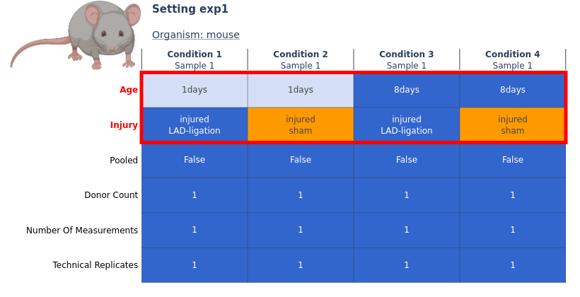

# Plots

FRED includes a function to plot the experimental design of a metadata file. 



The plot is structured like a heat map. The samples or conditions are plotted on the X-axis and the metadata fields on the Y-axis. This means that each column represents a sample and each row represents a metadata property of the sample. Different values within a row of the plot are colored differently. This allows identical and different values to be identified at a glance.

In addition to the colors, the cells can also be labeled with values. The experimental factors are highlighted in particular, as they are displayed in the top rows with a red border.

# Program Call

The plot function of FRED is called via
```bash
$ fred plot
```

with thes argument:

`-p, --path` the path of the metadata file

To show the correct usage of the function, as well as all possible arguments in a help message, the function can also be called with the parameter:

`-h, --help` show help message

# Optional arguments

| Argument          | Description | Value   |
| ----------------- | ----------- | ------- |
| -c / --config     | The config file contains information about the metadata structure and the whitelist repository.     | path to a YAML file; if not stated, the default FRED config is used | 
| -m / --mode       | The mode defines, wether samples or conditions are displayed.                                       | 'samples' or 'conditions'; default is 'samples                      |
| -s / --setting    | The number of the experimental setting that should be displayed (e.g. 1 for exp1, 2 for exp2, ...). | integer; default is 1                                               |
| -l / --labels     | This option defines, if the labels should be displayed for all cells, no cells or only the cells containing experimental factors. | 'all', 'factors', 'none'; default is 'factors' |
| -o / --output     | This option defines, if the plot should be displayed or saved to a file of a given type. | 'show', 'png', 'html'; default is 'show' |
| -f / --filename   | The path of the file, the plot should be saved to. The file extension is set according to the output option selectes with argument '-o / --output'. | path to file, e.g. 'my_plot' or 'my_output_folder/my_plot' |
| -b / --background | This option defines, wether the background should be white or transparent. | flag; If stated, background is white, else transparent |
| -cl / --condition_labels | This option defines, if the names of the conditions should be displayed instead of 'Condition 1', 'Condition 2', etc. | flag; If stated, condition labels are displayed as actual names, else they are stated as 'Condition 1', 'Condition 2', etc. |
| -sl / --sample_labels | This option defines, if the names of the samples should be displayed instead of 'Sample 1', 'Sample 2', etc. | flag; If stated, sample labels are displayed as actual names, else they are stated as 'Sample 1', 'Sample 2', etc. |
| -t / --transpose | This option transposes the plot. | flag; If stated, samples/conditions are on the y-axis and properties in the x-axis, else samples/conditions are on the x-axis and properties in the y-axis |
| -d / --drop_defaults | This option drops all properties, that only contain default values. | flag; If stated, all properties with only default values are removed from the plot |