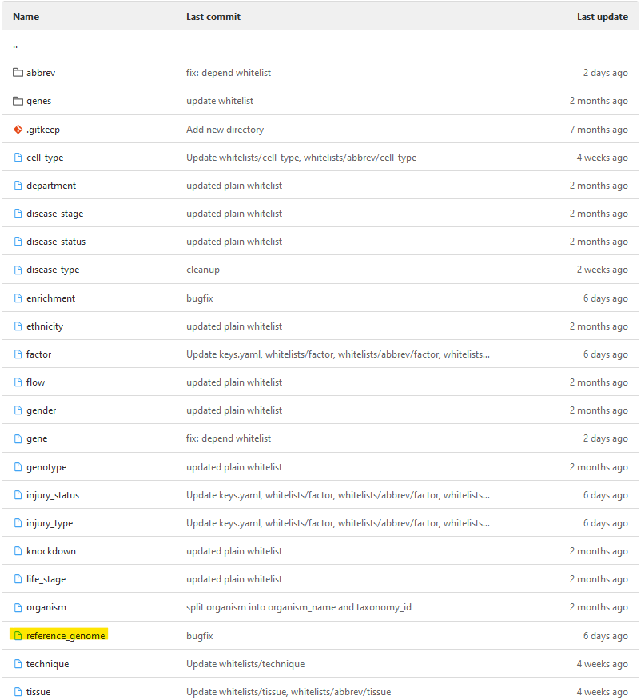
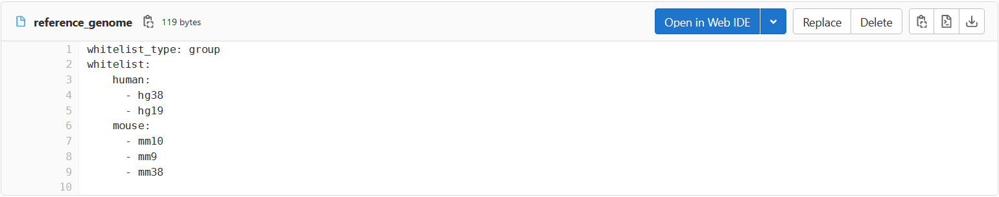

Adding values to a whitelist
=============================

For this example, we will extend the whitelist for ``reference_genome`` with the reference genomes for zebrafish (danrer10, danrer11). This whitelist is created as a whitelist of type ``group``. To show the extension of whitelists of different types, it is converted to a ``plain`` and ``depend`` format for this example as well.

Step 1: Finding the whitelist file and opening it in the web editor
--------------------------------------------------------------------

Go to the `whitelist folder <https://github.com/loosolab/FRED_whitelists/tree/main/whitelists>`_ in the repository. There, look for the file whose name matches the key whose possible values you want to extend. In this example, this is the file named ``reference_genome``.

Open this file. Inside Github you will see a blue button **Open in Web IDE** in the upper right corner.

Clicking on it will open an editor where you can edit the selected whitelist.

Step 2: Adding new values to the file
--------------------------------------

The following sections show the whitelist for ``reference_genome`` and how to expand it in each of the formats ``plain``, ``group``, and ``depend``.

plain
^^^^^^

The following snippet shows the whitelist file for ``reference_genome`` in type ``plain``.

.. code-block:: yaml

    whitelist_type: plain
    whitelist:
      - hg38
      - hg19
      - mm10
      - mm9
      - mm38

To add the reference genomes ``danrer10`` and ``danrer11`` to a whitelist of type ``plain``, they are inserted into the list under key ``whitelist``:

.. code-block:: yaml

    whitelist_type: plain
    whitelist:
      - hg38
      - hg19
      - mm10
      - mm9
      - mm38
      - danrer10
      - danrer11

group
^^^^^^

The following snippet shows the whitelist file for ``reference_genome`` in type ``group``.

.. code-block:: yaml

    whitelist_type: group
    whitelist:
        human:
          - hg38
          - hg19
        mouse:
          - mm10
          - mm9
          - mm38

In the ``group`` type whitelist, the specified reference genomes are grouped according to the organism to which they are assigned. To add the reference genomes ``danrer10`` and ``danrer11`` of the organism zebrafish in a meaningful way, we create the new category ``zebrafish`` as a key within the dictionary under ``whitelist``. This key ``zebrafish`` then gets ``danrer10`` and ``danrer11`` in a list as value.

.. code-block:: yaml

    whitelist_type: group
    whitelist:
        human:
          - hg38
          - hg19
        mouse:
          - mm10
          - mm9
          - mm38
        zebrafish:
          - danrer10
          - danrer11

depend
^^^^^^^

The following snippet shows the whitelist file for ``reference_genome`` in type ``depend``.

.. code-block:: yaml

    whitelist_type: depend
    ident_key: organism_name
    whitelist:
        human:
          - hg38
          - hg19
        mouse:
          - mm10
          - mm9
          - mm38

The whitelist of type ``depend`` is dependent on the input of another metadata field. The ``ident_key`` indicates that this metadata field is ``organism_name`` in our example. This means that different whitelist values can be entered for the reference genome depending on the specified organism.

.. important::

    The keys under ``whitelist`` must exactly match the ``organism_name`` values as they appear in the ``organism`` whitelist (the part before the space in each entry). Check the ``organism`` whitelist to ensure your key is spelled correctly.

Now, to add the reference genomes ``danrer10`` and ``danrer11``, we first look at the possible organisms in the ``organism`` whitelist [1]:

.. code-block:: yaml

    whitelist_type: plain
    headers: organism_name taxonomy_id
    whitelist:
        - Homo_sapiens 9606
        - Mus_musculus 10090
        - Danio_rerio 7955
        - Rattus_norvegicus 10116
        ...

In this whitelist we find an entry for zebrafish. From the header we see that the entry is composed of ``organism_name`` and ``taxonomy_id``. So for the entry ``Danio_rerio 7955`` we get the ``organism_name`` ``Danio_rerio``. We now enter this as a key in the dictionary under ``whitelist`` in our ``reference_genome`` whitelist. The syntax of the key must match the ``organism_name`` specified in the ``organism`` whitelist exactly. Then, this new key ``Danio_rerio`` receives a list containing the reference genomes ``danrer10`` and ``danrer11`` as value.

.. code-block:: yaml

    whitelist_type: depend
    ident_key: organism_name
    whitelist:
        human:
          - hg38
          - hg19
        mouse:
          - mm10
          - mm9
          - mm38
        Danio_rerio:
          - danrer10
          - danrer11

.. [1] https://github.com/loosolab/FRED_whitelists/blob/main/whitelists/organism

abbrev
^^^^^^^

Abbreviation whitelists are created for all values and keys that can occur in generated file names. This concerns all experimental factors and their values, as well as all organism names. In this example, an experimental factor ``injury`` was added to the whitelist ``factor``, for which an abbreviation must now be created in the abbreviation whitelist of ``factor``.

The illustrated yaml file shows the whitelist for experimental factors where ``injury`` has been added:

.. code-block:: yaml

    whitelist_type: plain
    whitelist:
        - genotype
        - tissue
        - cell_type
        - knockdown
        - gender
        - life_stage
        - age
        - ethnicity
        - gene
        - disease
        - treatment
        - time_point
        - flow
        - enrichment
        - body_mass_index
        - injury

A new key must now be added to the abbreviation whitelist for ``injury``. This key ``injury`` then contains an abbreviation as value. Abbreviations may only contain letters and numbers. Please note that the created abbreviation may only appear once in the whitelist. For ``injury`` the abbreviation ``inj`` was defined.

.. code-block:: yaml

    whitelist_type: abbrev
    whitelist:
        genotype: gnt
        tissue: tis
        cell_type: clt
        knockdown: knd
        gender: gnd
        life_stage: lfs
        ethnicity: eth
        disease: dis
        treatment: trt
        time_point: tmp
        enrichment: enr
        body_mass_index: bmi
        injury: inj
