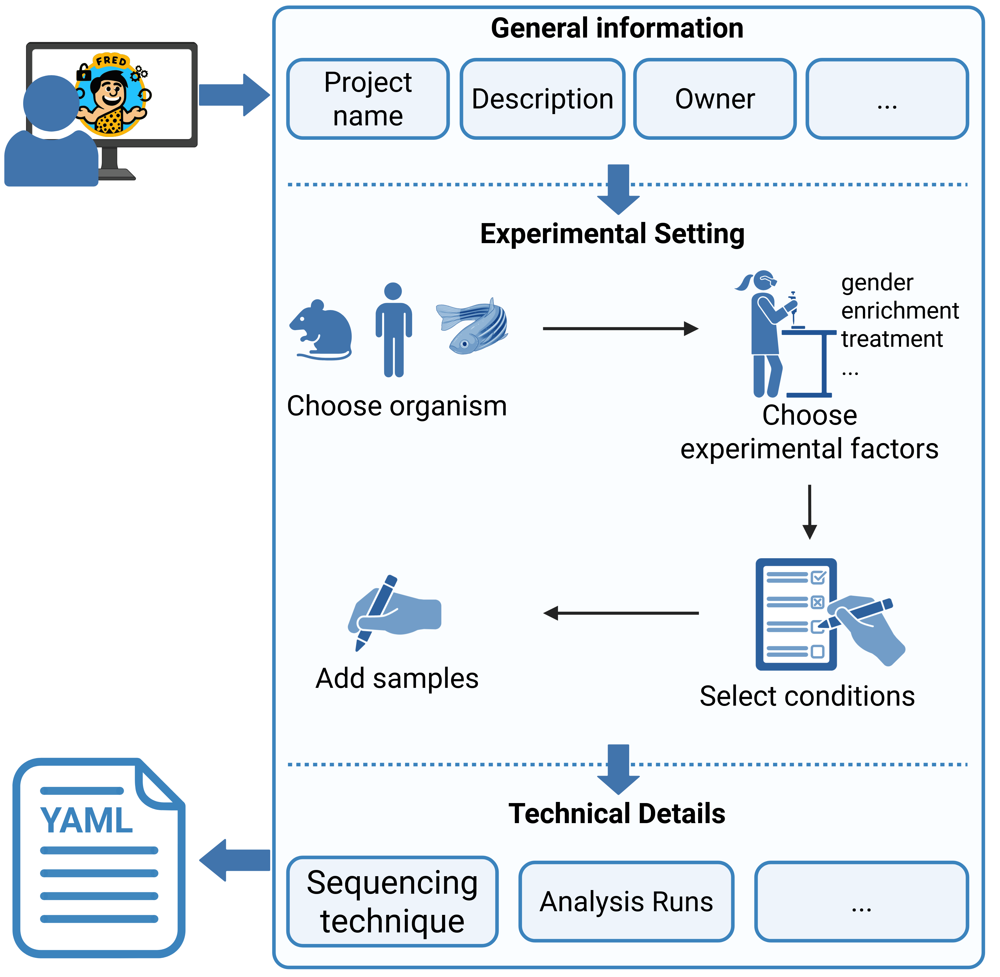

File Generation
=================

When publishing scientific studies, it is important to make all data and metadata available to promote scientific discovery and innovation. **FRED** allows users to create metadata files in a hierarchical structured YAML file using interactive dialogs.
The metadata is divided into three parts:

.. list-table::
   :width: 100%
   :widths: 25 75

   * - project
     - General information about the project like description or owner.
   * - experimental setting
     - Experimental Design information containing investigated conditions and their respective samples.
   * - technical details
     - Technical information about the project like sequencing technique or analysis runs.

Function Call
----------------

The generate function of FRED is called via

.. code-block:: bash
    
    fred generate

with the following arguments:

.. list-table::
   :width: 100%
   :widths: 25 75

   * - \-p, \-\-path
     - The path to the directory where the generated metadata YAML is to be stored.
   * - \-id, \-\-id
     - The ID of the project.
   * - \-c, \-\-config 
     - The path to a config file. If not stated, the default config is used.

The generate function has a mode in which only mandatory keys are requested in order to speed up metadata entry. The mandatory-only mode can be activated with the following argument:

.. list-table::
   :width: 100%
   :widths: 25 75

   * - \-mo, \-\-mandatory_only
     - If stated, the mandatory-only mode is activated.

To show the correct usage of the function, as well as all possible arguments in a help message, the function also be called with the parameter:

.. list-table::
   :width: 100%
   :widths: 25 75

   * - \-h, \-\-help
     - Show a help message.

Metadata Input 
-----------------

Dialog Options
^^^^^^^^^^^^^^^^^

.. list-table::
   :width: 100%

   * - **Text input:**
       Free text entry consisting of words, numbers, or dates.
     

   * - **Selections:**
       Selection of listed values by stating their number in the list.
     

   * - **Autofill:**
       Type in values that match a pre-defined list. Upon pressing the tabulator key, up to 30 values that match the input are displayed. If only one value matches, it is set as your input.  
     
    

Summary 
^^^^^^^^^^^^^^

After finishing a section of the metadata, a summary is displayed for checking if everything is correct. 
For the **project** and **technical details** section, the summary is displayed in YAML formatting. 
For the **experimental setting** section a plot is created. 

Experimental Factors, Conditions and Samples
^^^^^^^^^^^^^^^^^^^^^^^^^^^^^^^^^^^^^^^^^^^^^^^^^^

Select Experimental Factors
""""""""""""""""""""""""""""""""

Experimental Factors are used to create the conditions, so it is important to state all information that you actively compared between samples. 
Additional information that are not used to generate the conditions can be entered later per sample.
The following video explains how to differentiate experimental factors from additional information in more detail:

..  youtube:: 7SAsh-0FeR4
   :align: center
   :width: 100%

Combine Conditions
""""""""""""""""""""""

You create conditions by selecting experimental factors from the displayed list that will be combined. The factors are grouped by experimental factor. If the factor allows for a list as input,
you can select multiple values from this factor. If your selection is not a valid condition or already exists, you will be notified via a warning and prompted to redo your selection.
Once you selected your condition, you will be prompted to add samples. After finishing the sample input, you can add another condition.

Add Samples
""""""""""""""""

Once you selected a condition, you now have to add samples. Per Sample you need to state the number of technical replicates. Optionally you can then enter additional information like age oder cell type.
You have the option to enter multiple samples per condition.

Replicates & Measurements
""""""""""""""""""""""""""""""

.. list-table::
   :width: 100%

   * - Biological Replicates
     - A biological replicate captures random biological variation and typically originates from an individual organism. It usually corresponds to the tube collected from the donor.
   * - Technical Replicates
     - Result of measuring one biological replicate including all technical noise induced by experimental/measurement protocols (typically just 1). Occurs when an experiment is repeated or a sequencing library is recreated based on the same biological replicate.
   * - Number of Measurements
     - A measurement represents one readout of a technical replicate. Occurs when the same sequencing library is sequenced again or when an MS sample is splitted and/or measured multiple times. Does not contain any technical noise apart from the measurement itself.
