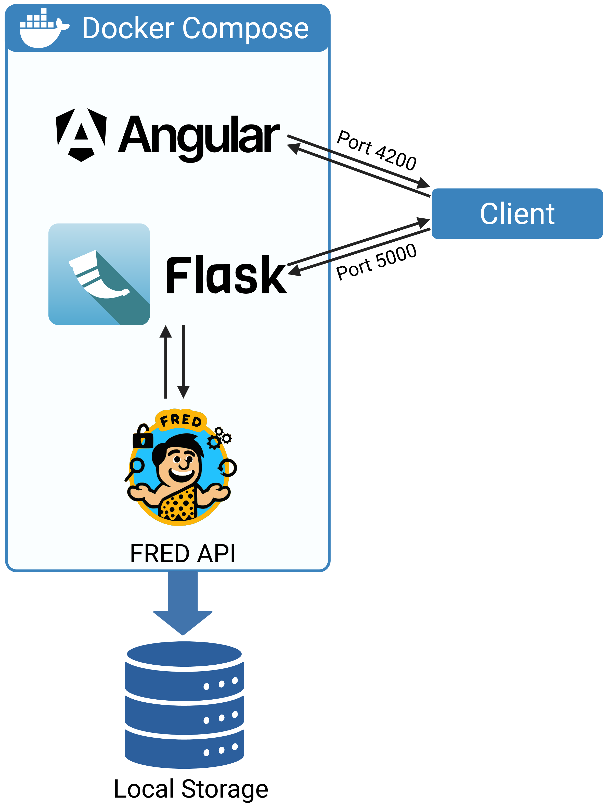

Standalone Web Frontend
=========================

FRED provides a graphical user interface consisting of two containers, a web app using Angular and a REST-application programming interface using Flask. 
The containers can be built and started using docker compose.

How to install
----------------

The standalone Version of FRED is located in a `separate Repository <https://github.com/loosolab/FRED_standalone>`_. 

1. Clone the repository 

.. code-block::
    
    git clone https://github.com/loosolab/FRED_standalone

2. Move to the new repository directory

.. code-block::

    cd FRED_standalone

3. Start the containers using docker compose

    a.  Run with build: Use this the first time you are deploying the containers.

    .. code-block::

        docker compose up --build
    
    b. Run without build: Use this if you aleady built the containers.
    
    .. code-block::

        docker compose up

You can now navigate to the web-frontend in your Browser. You find it under http://localhost:8080/.

Metadata Input
----------------

To generate a metadata file, click on the **Enter Metadata**-Button on the right side of the website.

The metadata input is shown in the following video (from 02:51):

..  youtube:: 4XuikkG0PdQ
   :align: center
   :width: 100%